
<a href="MERGE_PORTFOLIO.md"><picture><source media="(max-width: 600px)" srcset="./assets/hero-mobile.svg">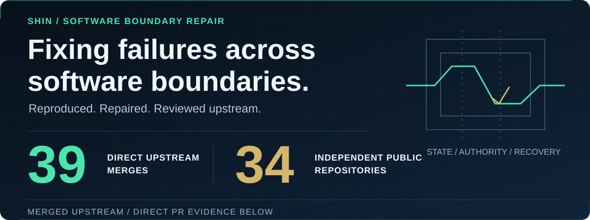</picture></a>

<a href="https://github.com/apple/swift-openapi-generator/pull/939">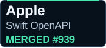</a>

<a href="https://github.com/usnistgov/macos_security/pull/775">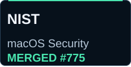</a>

<a href="https://github.com/besu-eth/besu/pull/11128">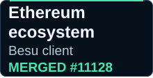</a>
<a href="https://github.com/anza-xyz/kit/pull/1971">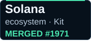</a>
<a href="https://github.com/vercel/workflow/pull/3575">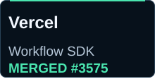</a>

<a href="https://github.com/Adyen/adyen-node-api-library/pull/1760">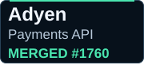</a>
<a href="https://github.com/toyota-connected/emb_cli/pull/240">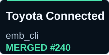</a>

<a href="https://github.com/rdkit/rdkit/pull/9512">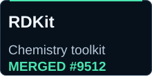</a>
<a href="https://github.com/OSC/ondemand/pull/5725">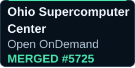</a>

<a href="https://github.com/WorksApplications/sudachi.rs/pull/360">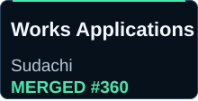</a>
<a href="https://github.com/PowerGridModel/power-grid-model/pull/1547">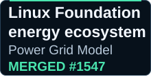</a>
<a href="https://github.com/dynawo/dyn-grid-compliance-verification/pull/385">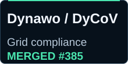</a>
<a href="https://github.com/KaotoIO/camel-catalog/pull/130">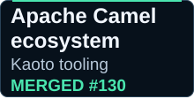</a>

<a href="https://github.com/openssl/openssl/commit/aeeca5a9e07166183fe323f336c9177a9b524c78">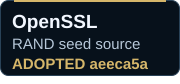</a>

OpenSSL: maintainer-committed adoption, separate from the direct merge count.

I repair software boundary failures where systems report the wrong state, retain the wrong authority, or cannot recover cleanly after failure.

**[39 direct upstream merges across 34 independent public repositories](MERGE_PORTFOLIO.md)**

**If your system has one of these failure modes, send me the failing path or reproduction:** [siriusa.paper@gmail.com](mailto:siriusa.paper@gmail.com)

## Failure classes

Typical failures I work on:

- **Completion** — a system reports success before the requested state actually exists.
- **Authority** — permissions, policy, or access survive beyond the boundary where they should end.
- **Recovery** — failure leaves stale state, lost diagnostics, or a broken retry path.

<strong>State / completion truth</strong>

- **[Microsoft / Power Platform provider](https://github.com/microsoft/terraform-provider-power-platform/pull/1254)** — HTTP 409 could report success before the requested remote state existed → the merged fix checks remote state before declaring success; otherwise it retries.

<strong>Authority / policy boundaries</strong>

- **[Rundeck](https://github.com/rundeck/rundeck/pull/10488)** — project import permission could allow configuration changes without `configure` authorization → the merged fix requires both permissions for configuration imports.
- **[NIST / mSCP](https://github.com/usnistgov/macos_security/pull/775)** — excluded rules appeared in the JSON manifest → the merged fix omits them; Shin is named in [Release 27.0](https://github.com/usnistgov/macos_security/releases/tag/release_27.0).

<strong>Recovery / failure integrity</strong>

- **[Kakao / actionbase](https://github.com/kakao/actionbase/pull/505)** — an encoding exception could permanently remove a borrowed buffer from the pool → the merged fix returns it in `finally`, preserving later reuse.
- **[FOSSLight / fosslight_util](https://github.com/fosslight/fosslight_util/pull/319)** — failed log-destination setup could detach the active file handler before the caller could record the failure → the merged fix prepares the destination first, preserving diagnostics and retryability.
- **[OpenSSL](https://github.com/openssl/openssl/pull/32685)** — recursive RAND seed-source construction exhausted the stack → clean failure in a [maintainer-committed repair](https://github.com/openssl/openssl/commit/aeeca5a9e07166183fe323f336c9177a9b524c78).

<strong>Representation / boundary consistency</strong>

- **[Mercedes-Benz / odxtools](https://github.com/mercedes-benz/odxtools/pull/532)** — length-prefixed diagnostic strings mixed UTF-8 byte counts with a different configured encoding → the merged fix uses one encoding consistently for the prefix and payload.
- **[Apple / Swift OpenAPI Generator](https://github.com/apple/swift-openapi-generator/pull/939)** — duplicate generated schema names crashed generation → the merged fix emits a deterministic error.

Additional upstream evidence

- **[ESA / pagmo2](https://github.com/esa/pagmo2/pull/634)** — C++20 stateless lambdas broke BFE test assumptions → the merged tests and docs reflect the language change.
- **[Hyperledger Besu](https://github.com/besu-eth/besu/pull/11128)** — ordinary `state-test --json` mixed a human summary into JSONL → the merged fix keeps that output machine-readable.
- **[Toyota Connected / emb_cli](https://github.com/toyota-connected/emb_cli/pull/240)** — packaging staging spawned `chmod` once per mode-bearing file → the merged fix batches destinations by mode within bounded argv chunks while preserving copy/permission order and failure handling.

[View all upstream contributions →](MERGE_PORTFOLIO.md)

<strong>APPROVED / OPEN — pending contributions, not merged</strong>

- [Apache / Jena #4314](https://github.com/apache/jena/pull/4314) — **APPROVED**
- [NVIDIA / GPU Operator #3028](https://github.com/NVIDIA/gpu-operator/pull/3028) — **OPEN**
- [Django / Cookie messages #22085](https://github.com/django/django/pull/22085) — **OPEN**
- [Adobe / Magento / Magento 2 #41430](https://github.com/magento/magento2/pull/41430) — **OPEN**
- [Siemens / Industrial Experience #2862](https://github.com/siemens/ix/pull/2862) — **OPEN**
- [Panasonic / Connect / Teams hook #188](https://github.com/PanasonicConnect/notify-teams-workflows-webhook/pull/188) — **OPEN**
- [Universal Robots / ROS 2 Driver #2013](https://github.com/UniversalRobots/Universal_Robots_ROS2_Driver/pull/2013) — **OPEN**
- [Universal Robots / Client Library #588](https://github.com/UniversalRobots/Universal_Robots_Client_Library/pull/588) — **OPEN**
- [Kakao / actionbase / pool #506](https://github.com/kakao/actionbase/pull/506) — **OPEN**
- [NAVER / Fixture Monkey #1349](https://github.com/naver/fixture-monkey/pull/1349) — **OPEN**
- [Samsung / TizenRT #7549](https://github.com/Samsung/TizenRT/pull/7549) — **OPEN**
- [Metabase / Analytics platform #80783](https://github.com/metabase/metabase/pull/80783) — **OPEN**
- [NASA JPL / Explorer-1 #892](https://github.com/nasa-jpl/explorer-1/pull/892) — **OPEN**
- [CERN ROOT / Cling #568](https://github.com/root-project/cling/pull/568) — **OPEN**
- [NII Cloud Ops / nbsearch #76](https://github.com/NII-cloud-operation/nbsearch/pull/76) — **OPEN**
- [Keycloak / Identity platform #51749](https://github.com/keycloak/keycloak/pull/51749) — **OPEN**
- [AWS Samples / Customer data lake #330](https://github.com/aws-samples/sample-voice-of-customer-datalake/pull/330) — **OPEN**
- [Temporal / Deputy / experimental #314](https://github.com/temporalio/deputy/pull/314) — **OPEN**

## Applied work

### Sensitive Data Egress Gate

Applying the same boundary-repair approach to bounded data loss after credential compromise.

**Design the maximum loss after one credential is compromised.**

If one administrator credential is abused, can it reach 100 records, 10,000, or effectively all of them?

I design bounded data-egress conditions across volume, time, approval, destination, and exception paths.

- [Service and design approach →](https://shin4141.github.io/sensitive-data-egress-gate/)
- [Reference implementation →](https://github.com/shin4141/sensitive-data-egress-gate-reference)

The service page includes a sample deliverable.

**You can commission the design only. Your existing engineers or vendor can implement it internally.**

## Projects and contact

Other projects: [Decision-OS V13 LoopKit](https://github.com/shin4141/decision-os-v13-loopkit) · [Value-Locked Repository Recovery](https://github.com/shin4141/value-locked-repository-recovery-public) · [AGENTS.md Compactor](https://github.com/shin4141/agents-md-compactor)

Contact: [siriusa.paper@gmail.com](mailto:siriusa.paper@gmail.com)
